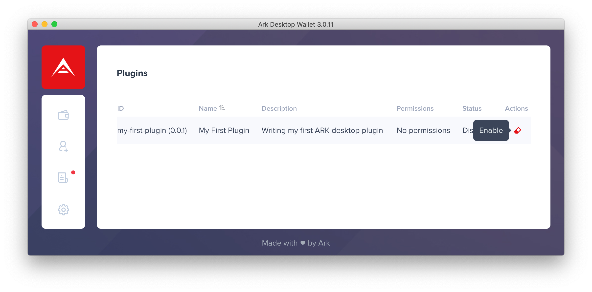
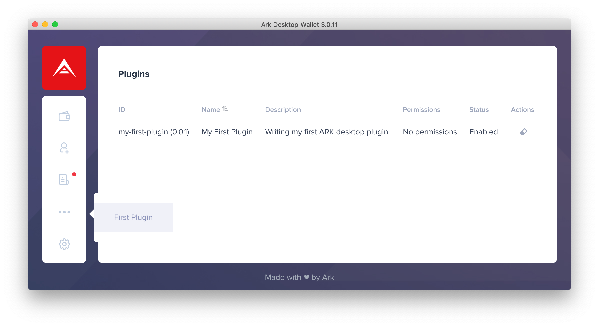

# Developing Your First Plugin

In this guide, we will cover setting up your development environment, explain the structure of the plugins, and create our first custom plugin using a simple example.

## Plugin Architecture <a id="696a"></a>

The architecture of plugins adheres to the default npm package structure, meaning it should have a _package.json_ with your main file in which your code will reside.

To start a project, let’s create a directory with the **`mkdir`** command, open it and run **`yarn init`**, which will open an interactive session to create a _package.json_ file. We then create a new file in the _src_ directory named _index.js_.

```text
mkdir my-first-plugin && cd $_
yarn init
mkdir src && touch src/index.js
```

The structure of the plugin now looks like this:

```text
|-- src
|---- index.js
|-- package.json
```

Your main file is where you will interact with the plugin’s API. You must export an object containing the methods that will be called by the Desktop Wallet.

## Writing Your First Plugin <a id="d6b5"></a>

As mentioned above, in the main file we have the lifecycle event **`register`**that is called when the plugin is loaded.

The **`getComponentPaths`** method should return a key-value object in which the _key_ is the name of the component and the _value_ is the relative path of the file to be rendered.

Now to reflect this we need to update our main file **index.js**:


```javascript
module.exports = {
  register() {
    console.log(`I'm a plugin`)
  },
  getComponentPaths() {
    return {
      'my-first-plugin': './my-first-plugin.js'
    }
  }
}
```


And the **`my-first-plugin.js`** file should be a valid [_Vue Component_](https://vuejs.org/v2/guide/components.html) object, currently you can not write your plugin as a [_Single File Component_](http://vuejs.org/v2/guide/single-file-components.html)_,_ but instead of using the **`<template>`** tag you will write your HTML into the **`template`** field:


```javascript
module.exports = {
  template: `
    <div>
      <h1>{{ description }}</h1>
    </div>
  `,
  data: () => ({
    description: 'My first component'
  })
}
```


## Running Your Plugin <a id="5722"></a>

Now that our definition file and component are ready, let’s check if it’s working:

1. Clone the official desktop-wallet repository and prepare your environment:

```text
cd ..
git clone https://github.com/ArkEcosystem/desktop-wallet
cd desktop-wallet
yarn install
```

2. Move your project directory to the plugins folder:

```text
mv ../my-first-plugin/ ~/.ark-desktop/plugins/
```

3. Now you are able to run it and test your plugin by running the wallet:

```text
yarn dev
```

4. Open the **Desktop Wallet** and go to the **Sidebar &gt; Plugin Manager** and **enable** it.



**Well OK, but where is my component at?**

In fact, the previous method only registers your component globally to be used at another time in your application. So to tackle this we’ll be adding a custom page and navigation icon.

## Adding a Custom Page <a id="81f1"></a>

If you need to add a custom page to your plugin, use the **`getRoutes`** method to link your component to the route path.

This should return an array of [_route configuration_](https://router.vuejs.org/api/#routes) to be used by the [_vue-router_](https://router.vuejs.org/).

Our main file will look like this after we add it:


```javascript
module.exports = {
  register() {
    console.log(`I'm a plugin`)
  },
  getComponentPaths() {
    return {
      'my-first-plugin': './my-first-plugin.js'
    }
  },
  getRoutes() {
    return [
      {
        path: '/first-plugin',
        name: 'first-plugin-route',
        component: 'my-first-plugin'
      }
    ]
  }
}
```


## Adding a Navigation Icon <a id="ba69"></a>

You can add a link to your route in the sidebar using the **`getMenuItems`**method, which should return an array of objects containing the route name and title.


```javascript
module.exports = {
  register() {
    console.log(`I'm a plugin`)
  },
  getComponentPaths() {
    return {
      'my-first-plugin': './my-first-plugin.js'
    }
  },
  getRoutes() {
    return [
      {
        path: '/first-plugin',
        name: 'first-plugin-route',
        component: 'my-first-plugin'
      }
    ]
  },
  getMenuItems() {
    return [
      {
        routeName: 'first-plugin-route',
        title: 'First Plugin'
      }
    ]
  }
}
```


## Security <a id="b910"></a>

If you try to run this code, the wallet will throw an error because you are accessing features that need permissions. To define which permissions are allowed and you want to use you need to define them in your **`package.json`**:


```javascript
{
  "name": "my-first-plugin",
  "version": "0.0.1",
  "title": "My First Plugin",
  "description": "Testing my first plugin on Ark Desktop Wallet",
  "main": "src/index.js",
  "permissions": [
    "COMPONENTS",
    "ROUTES",
    "MENU_ITEMS"
  ]
}
```


Now you can finally access your component by clicking the side menu button.



## Interacting With Data <a id="41b9"></a>

Each component file can access the global **`walletApi`** object that contains some APIs that you can interact directly in the wallet.

### Listening Events <a id="a89a"></a>

Let's start by watching new transactions \(sent or received\) on any imported wallet or contact.

To achieve this we need to use the **`eventBus`** API:


```javascript
module.exports = {
  template: `
    <div>
      <h1>{{ description }}</h1>
    </div>
  `,
  data: () => ({
    description: 'My first component'
  }),
  mounted () {
    walletApi.eventBus.onAny(eventName => {
      if (eventName.includes('transaction:new')) {
        console.log('New transaction!')
      }
    })
  }
}
```


**`eventBus`** is an [_emittery_](https://github.com/sindresorhus/emittery) instance. You can use its methods provided in the documentation. The wallet triggers an event similar to this **`wallet:<address>:transaction:new`** when identifying a new transaction.

### Emitting Notifications <a id="45c2"></a>

Instead of displaying a message on the console you can issue a notification using the alert API:


```javascript
module.exports = {
  template: `
    <div>
      <h1>{{ description }}</h1>
    </div>
  `,
  data: () => ({
    description: 'My first component'
  }),
  mounted () {
    walletApi.eventBus.onAny(eventName => {
      if (eventName.includes('transaction:new')) {
        walletApi.alert.info('New transaction!')
      }
    })
  }
}
```


It has 4 notification types: **`info`**, **`success`**, **`warn`** and **`error`**.

You also need to set the permissions:


```javascript
{
  "name": "my-first-plugin",
  "version": "0.0.1",
  "title": "My First Plugin",
  "description": "Testing my first plugin on Ark Desktop Wallet",
  "main": "src/index.js",
  "permissions": [
    "COMPONENTS",
    "ROUTES",
    "MENU_ITEMS",
    "EVENTS",
    "ALERTS"
  ]
}
```


## Limitations <a id="a4f4"></a>

At this point, you probably noticed that you can not run or import everything in your file, this includes the DOM, external packages, node builtin APIs. That is because your plugin is running through a sandbox, all thanks to the [**vm2**](https://github.com/patriksimek/vm2) package we are using in Desktop Wallet.

## Outro <a id="7174"></a>

Congrats you just developed your very first Desktop Wallet plugin! Now it is time to experiment on your own, and don’t forget we have our [**Development Bounty Program**](https://bounty.ark.io/) running, you are more than welcomed to jump in any time.

If you want to learn from already developed plugins for the Desktop Wallet, have a look in our official [**Desktop Plugins repository**](https://github.com/ark-ecosystem-desktop-plugins) which currently consists of these plugins:

* [_**Explorer plugin**_](https://github.com/ark-ecosystem-desktop-plugins/explorer)
* [_**Additional avatars plugin**_](https://github.com/ark-ecosystem-desktop-plugins/additional-avatars)
* [_**Dark contrast theme plugin**_](https://github.com/ark-ecosystem-desktop-plugins/dark-contrast-theme)
* [_**Sound notification plugin**_](https://github.com/ark-ecosystem-desktop-plugins/sound-notifications)


In the next tutorial we will look develop a custom desktop-wallet theme plugin. 

